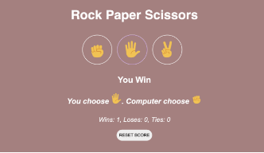

# Rock Paper Scissors Game ✊✋✌️

## 📌 Overview

This is a simple **Rock Paper Scissors** game built using **HTML, CSS, and JavaScript**. The game allows a user to play against the computer, with the computer making random choices.

## 🚀 Features

- 🎮 Play against the computer
- 🔀 Random computer-generated choices
- 🏆 Instant feedback on win/loss
- 🎨 Simple and responsive UI

## 📷 Screenshot

## 🛠️ Technologies Used

- **HTML** - Structure of the game
- **CSS** - Styling and UI
- **JavaScript** - Game logic and interactivity

## 🎮 How to Play?

1. Choose **Rock (✊), Paper (✋), or Scissors (✌️)**.
1. The computer will randomly pick one.
1. The winner is decided based on these rules:
   1. **Rock beats Scissors**
   1. **Scissors beats Paper**
   1. **Paper beats Rock**
1. The game displays whether you **Win, Lose, or Draw**.

## 📌 Live Demo

👉 
[Play the Game](https://chandana439.github.io/rock-paper-scissors-/)

